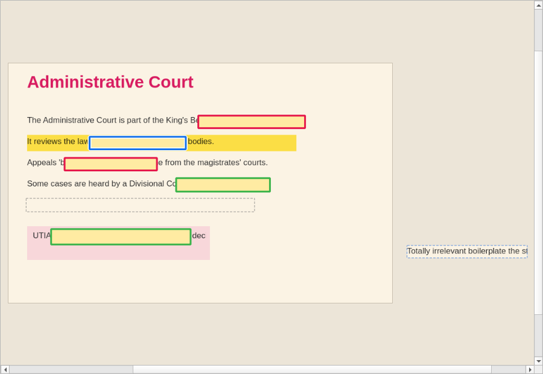
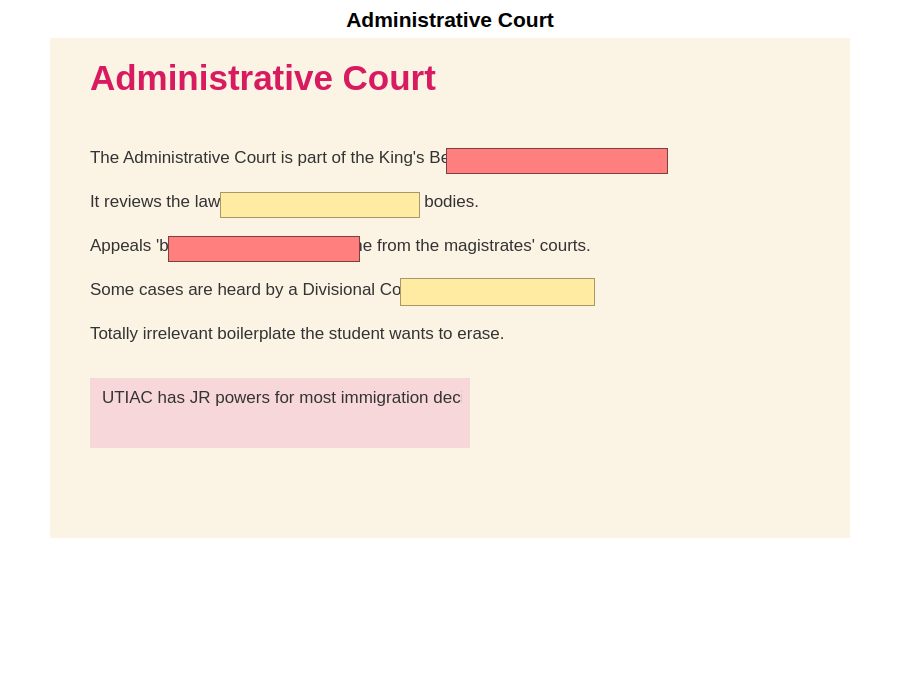
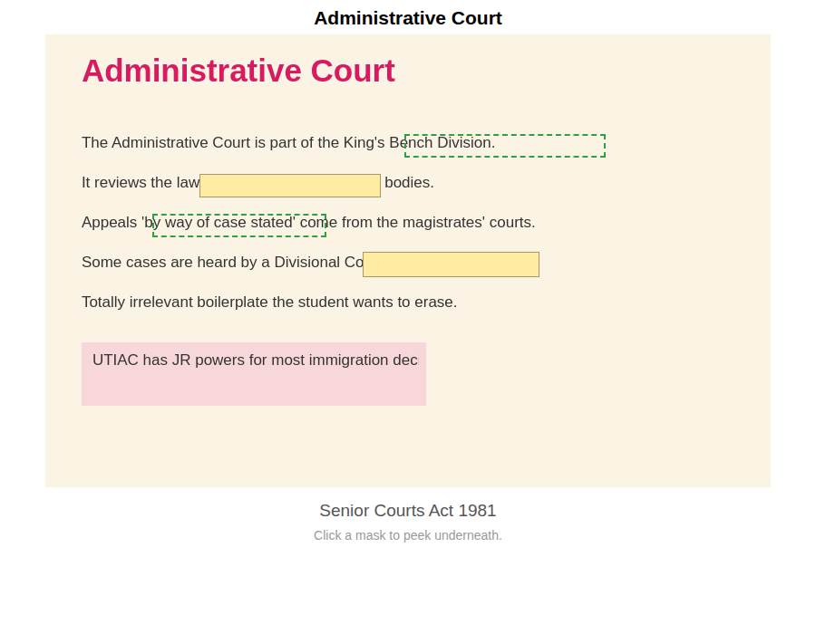
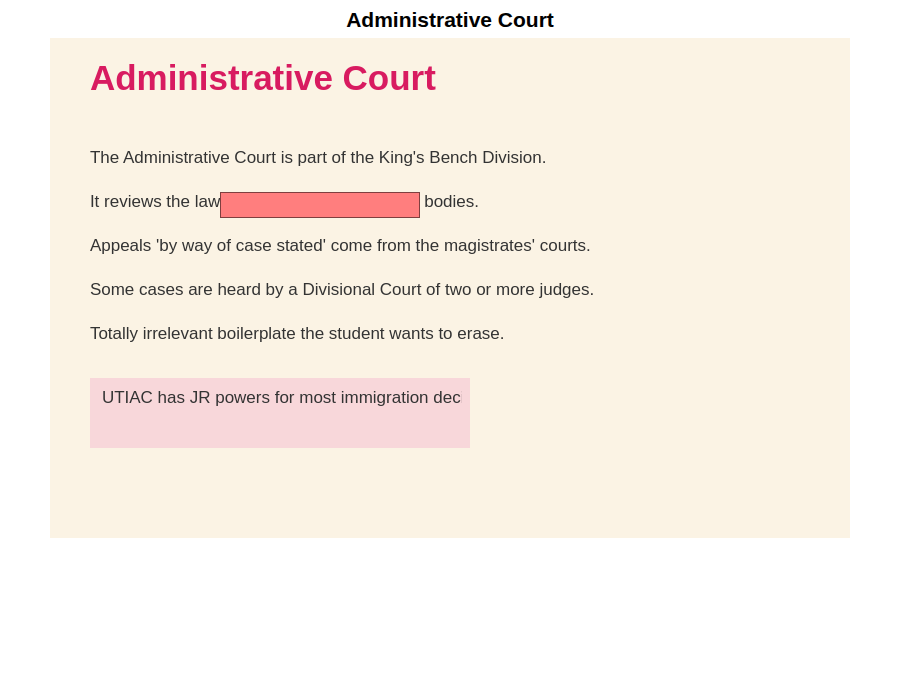
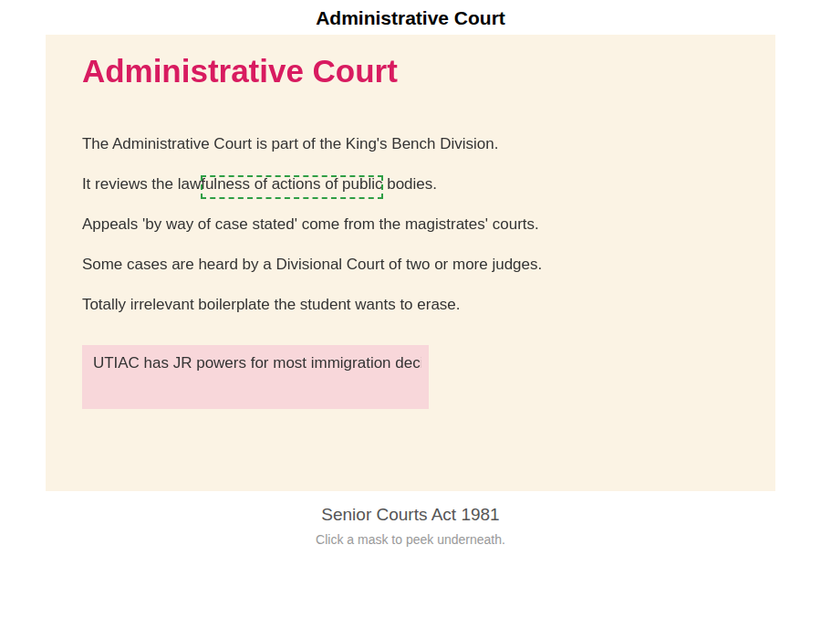

# Snip Occlusion

**Clipboard-first image occlusion for Anki, built for studying from slide decks
(BPP Adapt, PowerPoint, any presentation you can screenshot).**

Snip a slide → it lands in the editor automatically → draw boxes over the
facts you need to recall → erase the irrelevant text → one click adds the
cards.



*The editor: opaque masks (groups share a bold outline colour), a selected
box (blue outline with a white halo; resize handles appear on hover), a
cover-up box (grey dashed outline) that has erased a line of irrelevant
text by filling it with the slide's background colour, and a snip patch
(blue dashed outline) — a pixel-perfect cutout of that erased sentence,
parked outside the slide while rearranging.*

## Why this exists

[Image Occlusion Enhanced](https://github.com/glutanimate/image-occlusion-enhanced)
is brilliant, but day-to-day slide studying runs into a few walls. Snip
Occlusion keeps everything that works and fixes what doesn't:

| Kept from IOE | Fixed in Snip Occlusion |
| --- | --- |
| Clipboard image auto-loads when the editor opens | **Grouping is by explicit selection, not position** — shift-click any combination of boxes and press **G**. A box sandwiched between two grouped boxes stays independent. |
| Click-and-drag occlusion boxes | **Shift-click never moves a shape.** It only toggles selection, and no shape moves until the cursor travels a threshold (default 5 px, configurable) — so building up a selection can't nudge your boxes. |
| "Hide All, Guess One" and "Hide One, Guess One" card generation | **Dragging one shape moves only that shape**, even when several are selected. Hold **Ctrl** while dragging to move the whole selection deliberately. |
| Grouped shapes hidden/revealed together | **A cover-up (text eraser) tool**: draw a box over irrelevant slide text and it is filled with the slide's auto-detected majority colour, then baked into the image when cards are created. Right-click a cover-up box to sample the local background instead (for text on coloured callouts) or pick any colour. |
| | **A snip-patch tool**: cut out the one sentence you want to *keep* as a movable, pixel-perfect patch — drag it aside, cover up the rest of the paragraph, drag it back on top. Patches are copied from the original image with no rescaling, so there is zero quality loss. |
| | **Searchable image cards (OCR)**: when cards are added, the text on the image is read (Windows' built-in OCR, or Tesseract) and stored invisibly in a "Search Text" field, so Anki's browser and deck-search add-ons can find them. A "Text preview" button shows what was read; an `ocr_corrections` config map fixes recurring misreads permanently. |
| | **A new-card queue**: spin a sentence off to its own card — drag a snip patch off the canvas onto a queued card (or right-click → "Send to new card"). Multiple snips stack on a background matching the slide colour; queued cards load into the editor for masking after you add the current slide's cards. |
| | **A highlighter (H)**: perfectly straight highlight bands, drawn and edited exactly like boxes, painted in multiply mode so text stays readable underneath. Right-click for colours. Baked into the image, never a card. |
| | **Double-click word occlusion**: double-click any word to occlude exactly that word (hyphenated words count as one) — the box covers it fully and never touches neighbours. Dragging its side handles snaps whole-word-by-whole-word. Pixel analysis, no OCR. |
| | **Copy/paste boxes**: Ctrl+C / Ctrl+V duplicates selected shapes beside the originals, never overlapping; repeated pastes chain sideways. |

Plus editor quality-of-life: a left-hand toolbar, fully opaque masks, the
image always fits the window (until you zoom yourself), smooth high-quality
image display at any zoom, resize handles that appear only on hover, and a
maximizable window with **F11** full-screen for precise editing.

## How the cards look

| Hide All, Guess One — question | — answer |
| --- | --- |
|  |  |

The red boxes are the target group (note they skip the yellow box between
them). On the answer the target is revealed with a dashed outline; other
masks stay in place and can be clicked to peek underneath.

| Hide One, Guess One — question | — answer |
| --- | --- |
|  |  |

Cards are rendered with plain HTML/CSS/JS positioned by percentages, so they
scale to any window and **review correctly on AnkiDroid and AnkiMobile with
no add-on installed on the device**.

## Install

Requires Anki 2.1.50 or later (tested against Anki 26.08, works on both Qt5
and Qt6 builds — all Qt imports go through `aqt.qt`).

**From the packaged file:**

1. `python3 tools/build_ankiaddon.py` (or download `snip_occlusion.ankiaddon`
   from the CI artifacts).
2. In Anki: Tools → Add-ons → Install from file… → pick the `.ankiaddon`.
3. Restart Anki.

**For development:** copy (or symlink) the `snip_occlusion/` folder into your
Anki add-ons folder (Tools → Add-ons → View Files) and restart Anki.

## Workflow

1. In Anki, press **Ctrl+Shift+O** (or Tools → Snip Occlusion).
2. Snip your slide (**Win+Shift+S** on Windows). The image appears in the
   editor automatically. If you snip again mid-edit, the
   "Load new snip" button lights up instead of interrupting you.
3. Draw:
   - **R** — rectangle mask. Click-drag to draw.
   - **C** — cover-up box: erases slide text by covering it with the
     background colour. Never becomes a card — it permanently edits the
     image.
   - **P** — snip patch: cut out a sentence you want to keep, drag it
     aside, cover-up the paragraph it came from, then drag it back over
     the covered area. Right-click a patch to snap it back to where it
     was cut from.
   - **S** — back to select.
4. Group facts that should be revealed together: shift-click each box
   (anywhere on the slide, in any order), press **G**. Boxes in the same
   group share a bold outline colour. **U** ungroups.
5. Pick a deck, tags, header/footer, and a mode:
   - **Hide All, Guess One** — everything masked, target highlighted.
   - **Hide One, Guess One** — only the target masked.
6. **Add Cards** (or Ctrl+Enter). One card per group (ungrouped boxes are
   their own cards). The workspace clears, ready for the next snip.

### All shortcuts

| Keys | Action |
| --- | --- |
| S / R / H / C / P | Select / Rectangle / Highlighter / Cover-up / Snip patch |
| Double-click a word | Occlude that word — or highlight it, in the Highlighter tool |
| Ctrl+C / Ctrl+V | Copy selected shapes / paste beside them |
| T | See-through mode: outlines only, text visible underneath |
| Right-click a box | Peek underneath just that box (and group/colour options) |
| Click | Select a shape |
| Shift+click | Add/remove shape from selection (never moves it) |
| Drag on empty area | Rubber-band select |
| Drag a shape | Move **only that shape** |
| Ctrl+drag | Move all selected shapes |
| Arrows / Shift+arrows | Nudge 1 px / 10 px |
| G / U | Group / ungroup selection |
| Del | Delete selection |
| Ctrl+Z / Ctrl+Y | Undo / redo |
| Ctrl+wheel, +/-, F | Zoom, fit |
| Middle-drag | Pan |
| F11 | Full screen |
| Ctrl+Enter | Add cards |

**Editing existing cards:** open the card in Anki's editor (Browse, or
Edit during review) and click the **✂** button — the slide reopens with
all its boxes and groups for reworking; Save Changes updates every card
sharing that slide, adds cards for new boxes, and asks before deleting
cards whose boxes were removed.

**AI-suggested cards:** in the text card dialog, "✨ Suggest cards"
drafts Q/A pairs from your last snip's OCR text via the Claude API
(bring your own API key — `anthropic_api_key` in the config). Each
"Use →" opens the draft in its own window; the list stays behind so you
can pick several.

**Text cards in your own words:** press **Ctrl+Shift+T** (or the 📝
button in the editor) for a minimal Front/Back/Notes card with
bold/italic/underline and font size; "Copy text from previous snip"
drops your last snip's OCR text onto the front to rephrase.

**During review:** press **Delete** (or right-click → "Delete this
card") to remove a bad card instantly; **Shift+Delete** removes ALL
cards made from the same slide image (after a confirmation) — including
cards created by other occlusion tools like IOE. Ctrl+Z undoes either.

## Configuration

Tools → Add-ons → Snip Occlusion → Config. Options include the drag
threshold, mask colours, the default cover-up fill strategy
(`majority` / `local`), the opening shortcut, and the default card mode.
See [`snip_occlusion/config.md`](snip_occlusion/config.md) for details.

## Architecture

```
snip_occlusion/
├── __init__.py       # Anki entry point: Tools menu + shortcut
├── dialog.py         # main dialog: clipboard watching, deck/tags/mode, add
├── editor_canvas.py  # QGraphicsView editor: all mouse/keyboard handling
├── shapes.py         # pure-Python shape model (no Qt) + normalisation
├── color_utils.py    # majority-colour and local-background detection
├── notes.py          # note type management + note creation (no aqt)
├── template.py       # card templates: % -positioned mask divs + CSS
└── qtshim.py         # aqt.qt in Anki, PyQt6 in tests
```

Design notes:

- Shapes are plain dataclasses; the canvas paints them all from one overlay
  item. That is what makes the interaction rules (drag thresholds,
  move-one-not-all, explicit groups) straightforward to implement and test.
- Mask geometry is stored **normalised (0–1)** in a JSON field on the note,
  so cards don't depend on image resolution or the add-on at review time.
- One note = one card = one target group. The occluded image is shared.
- `shapes.py`, `notes.py`, and `color_utils.py` have no `aqt` dependency and
  are tested against a real temporary Anki collection.

## Tests

```bash
pip install PyQt6 anki pytest
QT_QPA_PLATFORM=offscreen python -m pytest tests/ -v
```

27 tests cover the shape model, colour detection, note/card creation against
a real collection, and — via synthesised mouse events on the offscreen
canvas — every interaction fix: the drag threshold, shift-click safety,
single-shape moves, arbitrary grouping, rubber-band selection, undo/redo,
and cover-up baking. `tools/render_preview.py` additionally renders the card
templates in headless Chromium and verifies mask positions land on the image
where the payload says they should.

## Licence

Apache License 2.0 (see [LICENSE](LICENSE)).
